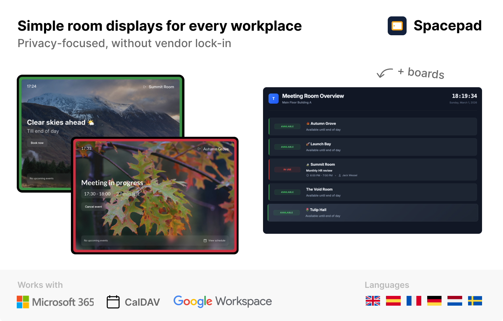

  <h1 align="center">Spacepad</h3>

  
Simple room displays for every workplace. Display room availability in real-time,  synced with your rooms and calendars — ideal for tablets outside meeting spaces or home-offices.  Suitable for both small offices and larger deployments.
     
     
    <a href="https://spacepad.io">Website</a>
    ·
    <a href="https://github.com/magweter/spacepad/issues">Report Issue</a>
    ·
    <a href="https://github.com/magweter/spacepad/discussions">Suggest Feature</a>
  

## Our Mission

We’re building focused, fun tools for modern offices — tools that just work, without enterprise BS.
Spacepad strives to be the perfect all-encompassing room display solution for SMB's.
  
✅ Simple: Easy to deploy and use 
🔐 Privacy-first: Self hosted and open source auditable 
💸 Fair and sustainable: We offer paid features to keep development active 
❤️ Designed with care: Beautiful on tablets, easy on the eye 

## Features

Spacepad offers a comprehensive suite of features to make managing and viewing room availability effortless.

### Core Features
- **Real-time room availability** - Events sync instantly and display current room status
- **Multi-room overview boards** - Create beautiful dashboards showing multiple rooms at once with customizable layouts (card, table, or grid view)
- **On-device room booking** - Book rooms directly from the display with preset durations (15/30/60 min) or custom time slots
- **Room check-in** - Check in to reserved meetings with configurable grace periods
- **Event cancellation** - Cancel current meetings directly from the display
- **Full day schedule** - View all upcoming events for the day on each display

### Calendar Integrations
- **Google Calendar** - Full integration with Google Workspace calendars
- **Microsoft 365** - Seamless sync with Outlook calendars via Microsoft Graph API
- **CalDAV** - Support for any CalDAV-compatible provider (Nextcloud, iCloud, etc.)
- **Real-time webhooks** - Instant updates when calendar events change

### Customization & Branding
- **Custom themes** - Dark, light, or system theme support
- **Custom logos** - Upload your organization's logo to displays and boards
- **Font selection** - Choose from multiple Google Fonts (Inter, Roboto, Open Sans, Lato, Poppins, Montserrat)
- **Multi-language support** - Available in English, Dutch, French, German, Spanish, and Swedish
- **Privacy controls** - Hide meeting titles for privacy-sensitive environments
- **Display settings** - Configure what information to show (booker name, next event, transitioning status)

### Workspace & Collaboration
- **Workspaces** - Organize displays, calendars, and boards by workspace
- **Team collaboration** - Share workspaces with team members with role-based access
- **Workspace-scoped resources** - All displays, calendars, and boards are organized per workspace

### Deployment Options
- **Cloud Hosted** - Get started in minutes with zero maintenance
- **Self Hosted** - Full control over your data with Docker deployment
- **Cross-platform** - Native iOS and Android apps built with Flutter

> [!TIP]
> The product is developing rapidly and we're happily accepting feedback and suggestions. Have a look at our [roadmap](#roadmap) on the implementation of new features or open a new [discussion](https://github.com/magweter/spacepad/discussions) to share ideas.

## 🔧 Get Started

### ☁️ Cloud Hosted (Easiest)

Looking to get started quickly? Get started in minutes using our cloud.

1. Visit [spacepad.io](https://spacepad.io)
2. Create a free account
3. Set up your first display — the first one is free forever
4. Add more displays at $6/month each

Great for fast deployments with zero maintenance.

### 🏗️ Self Hosted

Self hosting Spacepad is the perfect solution for businesses or enthousiasts who want control over their data.

As we believe in open source and personal tinkering, we want to support these communities.

🙎‍♂️ If you’re a hobbyist or home user, enjoy Spacepad self hosted without limits — completely for free.

🏢 If you're a business using Spacepad, we ask you to purchase a self-hosted license. We offer simple, sustainable and affordable flat-tiered pricing. Have a look at [Spacepad Pricing](https://spacepad.io/pricing).

For full setup instructions, see [Setup Guide](docs/SETUP.md).

## 🛠 Licensing

Spacepad is dual-licensed:

- 🧑‍💻 **Community License** ([LICENSE.md](LICENSE.md))  
  For personal use and self-hosted commercial use with up to 1 display.

- 🏢 **Pro License** ([LICENSE_PRO.md](LICENSE_PRO.md))  
  Required for commercial use with multiple displays or Pro features.

Purchasing a license helps support continued development.

## 🤝 Contributing

We love open source and welcome your contributions! See [CONTRIBUTING.md](CONTRIBUTING.md) to get started.

## 📅 Roadmap Highlights

- [x] Microsoft 365 / Outlook integration
- [x] Self-hosted deployment with Docker
- [x] Google Workspace / Google Calendar integration
- [x] CalDAV support (Nextcloud, iCloud, etc.)
- [x] On-device room booking with custom time slots
- [x] Room check-in and release functionality
- [x] Full day event schedule display
- [x] Custom themes, logos, and fonts
- [x] Multi-room overview boards (Pro feature)
- [x] Workspace management and collaboration
- [x] Multi-language support (6 languages)
- [x] Privacy controls for meeting titles
- [x] Multiple board view modes (card, table, grid)

Feature requests? We're all ears! Please open a new [discussion](https://github.com/magweter/spacepad/discussions).
