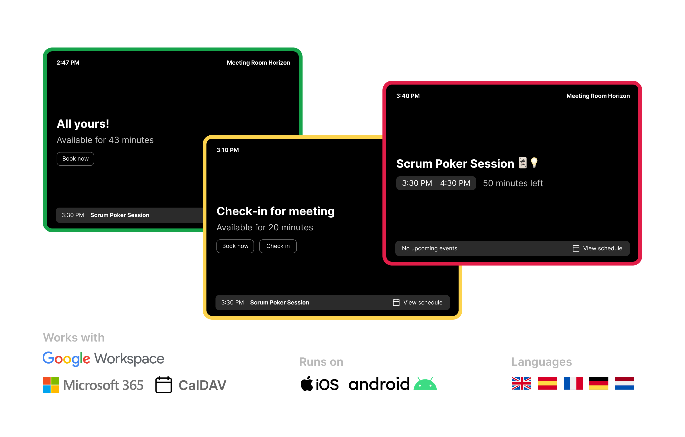

# Spacepad

Spacepad is a simple and fun meeting room occupancy display that helps you manage and visualize your meeting spaces effectively. Suitable for both small offices and larger deployments.



## Our Mission

Creating modern no-nonsense solutions for every office. Easy to use and affordable. While making meeting room management simple, intuitive, and enjoyable. 

## Key Features

- 🔄 **Real-Time Updates**: See room availability instantly
- 📅 **Calendar Integration**: Works with Microsoft 365
- 🎨 **Fun Interface**: Engaging and intuitive display
- 🚀 **Easy Setup**: Get up and running in minutes

## Why Spacepad?

- 🔌 **Simple Integration**: Works with your existing calendar infrastructure
- 📱 **Cross-Platform**: Access from any mobile device
- 🌍 **Flexible Display**: Perfect for tablets and displays outside meeting rooms
- ⚡ **Quick Status**: See room availability at a glance

## Quick Start

### Cloud Hosted Solution
Looking to get started for free with zero effort? Visit [spacepad.io](https://spacepad.io) to try out our cloud-hosted solution. We offer a free 7 day trial.
Cloud hosting is a great way to support this project for future development.

### Self-Hosted Option
We value the open source and self hosted communities. After all, your privacy and data should be protected at all costs.

To self host this application, you can deploy your own instance using Docker and Traefik out of the box.
Using other reverse proxies will also work, but might require a bit more configuration.

Get started setting up your own self hosted (production) instance:

```bash
# Clone the repository
git clone https://github.com/magweter/spacepad.git
cd spacepad

# Create the environment config
cp .env.example .env
```

Set the app key for the application:

```bash
# Linux
sed -i "s/^APP_KEY=.*/APP_KEY=$(php -r 'echo "base64:".base64_encode(random_bytes(32));')/" .env

# macOS
sed -i '' "s/^APP_KEY=.*/APP_KEY=$(php -r 'echo "base64:".base64_encode(random_bytes(32));')/" .env

# Windows (PowerShell)
(Get-Content .env) -replace '^APP_KEY=.*', "APP_KEY=$(php -r 'echo "base64:".base64_encode(random_bytes(32));')" | Set-Content .env
```

Now on to configuring the application:
1. Open the .env file and configure your domain and email.
1. Go to [Azure Portal - App Registrations](https://entra.microsoft.com/#view/Microsoft_AAD_RegisteredApps/ApplicationsListBlade/quickStartType~/null/sourceType/Microsoft_AAD_IAM)
1. Create a new app registration, only fill in a name and click 'create'
1. Open the 'verification' tab and create two new 'web' platforms:
    - https://your-domain.com/outlook-accounts/callback
    - https://your-domain.com/auth/microsoft/callback
1. Save, and click on 'API-permissions'
1. Click 'Microsoft Graph', delegated permissions and add `Calendars.Read.Shared`, `Place.Read.All` and `User.Read`.
1. Save, and click on 'certificates and secrets'
1. Create a new secret (not certificate) and copy the value
1. Click on 'overview' and copy the 'client id'. Beware: this is the client ID value you need, not the ID of the secret you just created.
1. Paste the values in the .env 'AZURE_AD...' variables

Now run the application using Docker Compose:
```bash
docker compose -f docker-compose.prod.yml up -d
```

Great! You should now be able to access the application at http://localhost.

Download the mobile app from the App Store or Play Store and follow the instructions 🚀

### Enterprise Solutions
We offer specialized support and modifications for enterprise deployments.

Contact us at support@spacepad.io for enterprise licensing and support options.

## Support

Need help? We offer multiple support channels:
- [Post an issue](https://github.com/magweter/spacepad/issues)
- [Email Support](mailto:support@spacepad.io) (for cloud hosted plans)

## License

Spacepad is distributed under a dual-license model:

- **Community Edition**: Available under the [Sustainable Use License](LICENSE.md) for non-commercial use
- **Enterprise Edition**: Commercial license with additional features and support. See [Enterprise License](LICENSE_EE.md) for details.

## Contributing

We welcome contributions! Please check our [Contributing Guide](CONTRIBUTING.md) to get started.

## Roadmap

- [ ] Custom display themes (colors & backgrounds)
- [ ] Multi-room dashboard view
- [ ] Bookings rooms via the app
